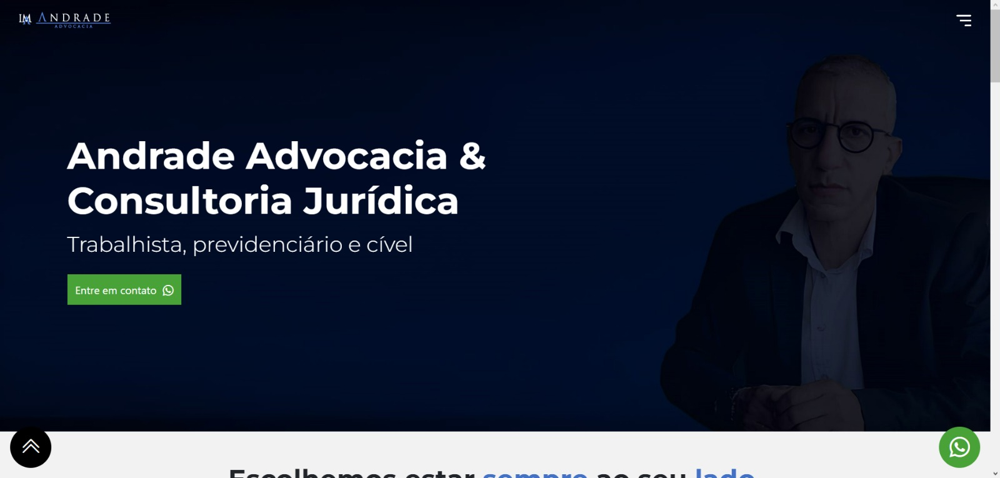
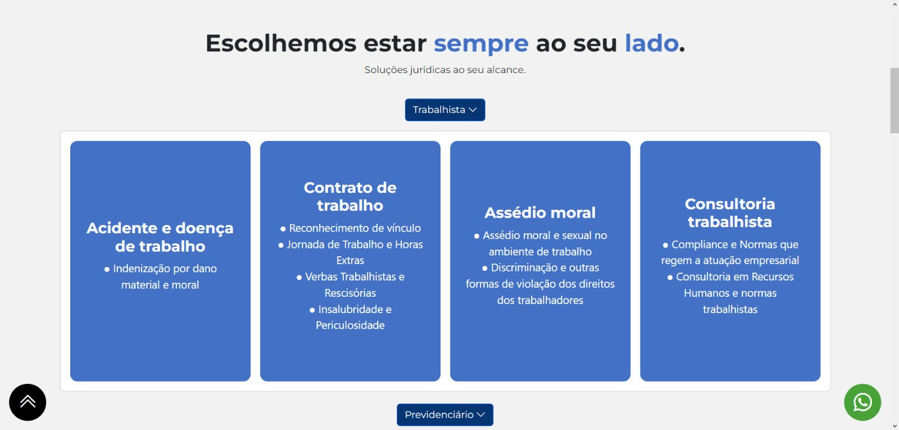
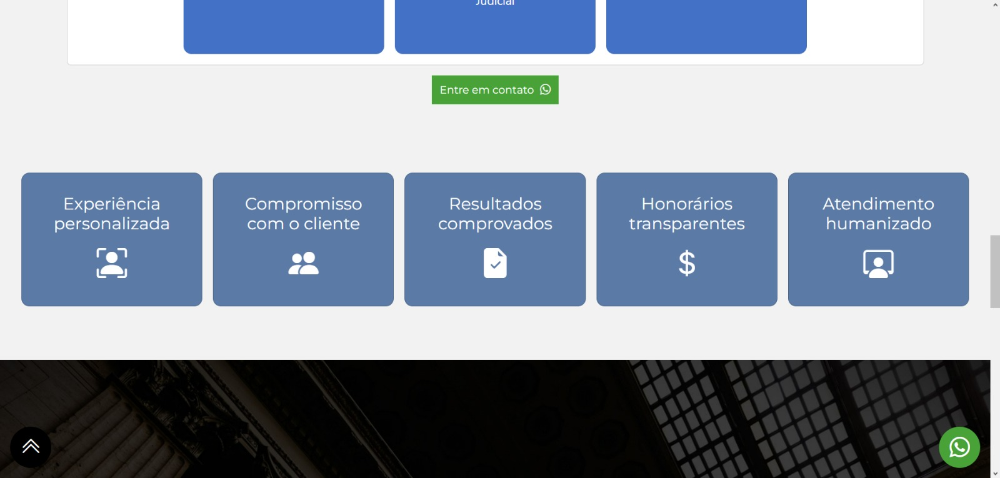
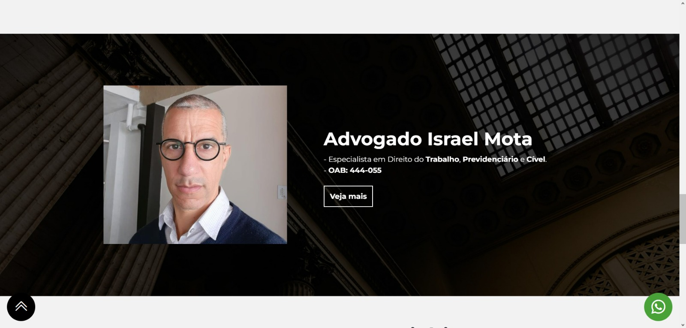
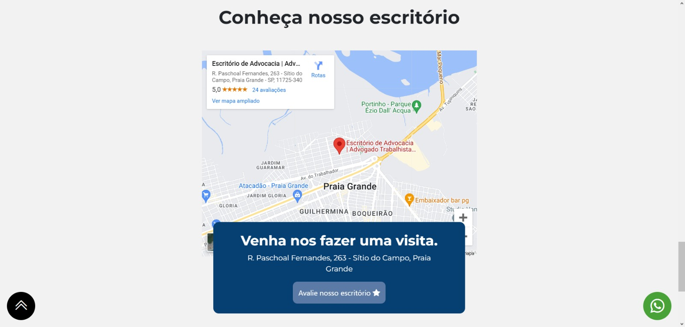

<h1 align="center"> Landing Page Andrade Advocacia </h1>

  <a href="#-tecnologias">Tecnologias</a>&nbsp;&nbsp;&nbsp;|&nbsp;&nbsp;&nbsp;
  <a href="#-projeto">Projeto</a>&nbsp;&nbsp;&nbsp;|&nbsp;&nbsp;&nbsp;
  <a href="#memo-licença">Licença</a>

  

 

  
  
  
  
  

## 🚀 Tecnologias

Esse projeto foi desenvolvido com as seguintes tecnologias:

- HTML
- SASS
- JAVASCRIPT
- Animation on Scroll Lib (AOS)
- Git e Github

## 💻 Projeto

Essa landing page foi desenvolvida para um advogado através de um briefing com o intuito de apresentar seus serviços e incluir seu negócio no âmbito digital para melhor conversão de clientes, complementando seus perfis nas redes sociais.

 - [Visite o projeto online](https://escritorioandradeadv.com.br)

## :memo: Licença

Esse projeto está sob a licença MIT.

---

Feito com ♥ by LuisHdev :wave: [Acesse meu linkedin!](linkedin.com/in/luis-henrique-a5a086250/)
